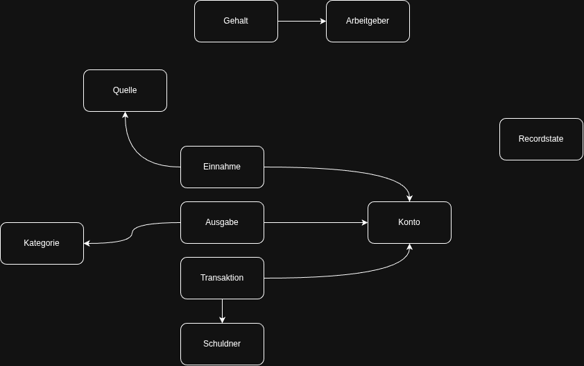

# Buchhaltung – Self-hosted Bookkeeping with Appsmith & PostgreSQL

A small self-hosted bookkeeping app (German UI) for tracking income and expenses by category and month. The frontend is built with [Appsmith](https://www.appsmith.com/), the data lives in PostgreSQL, and everything runs with Docker Compose.

## Features (ich bin ein böser Hacker)

- Record income (*Einnahmen*) and expenses (*Ausgaben*) with category, amount and month
- Account overview (*Kontoübersicht*)
- Monthly expense breakdown by category, including charts
- Soft delete: rows are never physically removed, they are marked via `fk_recordstate_sid` (`0` = active)
- Runs fully local, no cloud services needed

## Repository structure

```
.
├── appsmith/              # Exported Appsmith application (import this into Appsmith)
├── database/
│   └── schema.sql         # Empty database: tables, views, functions, sequences – no data
├── docker-compose.yml     # Appsmith and PostgreSQL (passwords removed)
└── README.md
```

> Adjust the paths above if your folders are named differently.

## Stack

| Service                | Image                  | Purpose                                   |
|------------------------|------------------------|-------------------------------------------|
| `appsmith`             | `appsmith/appsmith-ce` | Frontend / app builder (with its built-in database) |
| `buchhaltung-postgres` | `postgres:16`          | Bookkeeping data                          |

## Requirements

- Docker and Docker Compose v2
- A CPU with AVX support (required by Appsmith's built-in database; any reasonably modern x86 CPU has it)
- About 3 GB of free RAM (Appsmith is the heaviest part)

## Installation

### 1. Clone the repository

```bash
git clone https://github.com/<your-user>/<your-repo>.git
cd <your-repo>
```

### 2. Set passwords

The `docker-compose.yml` in this repo contains no passwords. Fill them in before starting, either directly in the file or (recommended) in a `.env` file next to it:

```env
POSTGRES_USER=buchhaltung
POSTGRES_PASSWORD=change-me
POSTGRES_DB=buchhaltung_db
```

Never commit your `.env` file. Add it to `.gitignore`.

### 3. Start the containers

```bash
docker compose up -d
```

### 4. Create the database schema

```bash
docker exec -i buchhaltung-postgres psql -U buchhaltung -d buchhaltung_db < database/schema.sql
```

This creates all tables, views and functions, plus the required lookup values (e.g. record states). It contains no bookkeeping data.

Here the ER-Modell



### 5. Import the app into Appsmith

1. Open `http://<server-ip>:8080` and create an admin account.
2. On the Appsmith home page choose **Create new → Import** and select the file from the `appsmith/` folder.
3. When asked for the datasource, enter the PostgreSQL connection:
   - Host: `buchhaltung-postgres`
   - Port: `5432`
   - Database: `buchhaltung_db`
   - User / password: as set in step 2

Datasource credentials are never included in an Appsmith export, so you always have to enter them after importing.

## Backups

PostgreSQL (bookkeeping data):

```bash
docker exec buchhaltung-postgres pg_dump -U buchhaltung buchhaltung_db \
  | gzip > buchhaltung_db_$(date +%F_%H-%M-%S).sql.gz
```

Appsmith (apps, users and settings):

```bash
docker exec appsmith appsmithctl backup
```

The backup archive is written to `/appsmith-stacks/data/backup/` inside the container, which lives in the Appsmith volume. Restore it with `docker exec -it appsmith appsmithctl restore`.

Restore PostgreSQL:

```bash
gunzip -c buchhaltung_db_<date>.sql.gz | docker exec -i buchhaltung-postgres psql -U buchhaltung -d buchhaltung_db
```

## Troubleshooting

**Appsmith keeps showing "Appsmith is starting" and reloading.** Check the logs with `docker logs appsmith --since 2m`. First start can take a few minutes. If you see `AVX instruction not found`, your CPU is too old for Appsmith's built-in database.

**Charts show nothing although the query returns data.** PostgreSQL `numeric` values sometimes arrive in Appsmith as strings. Cast amounts with `::float8` in the query for chart data.

